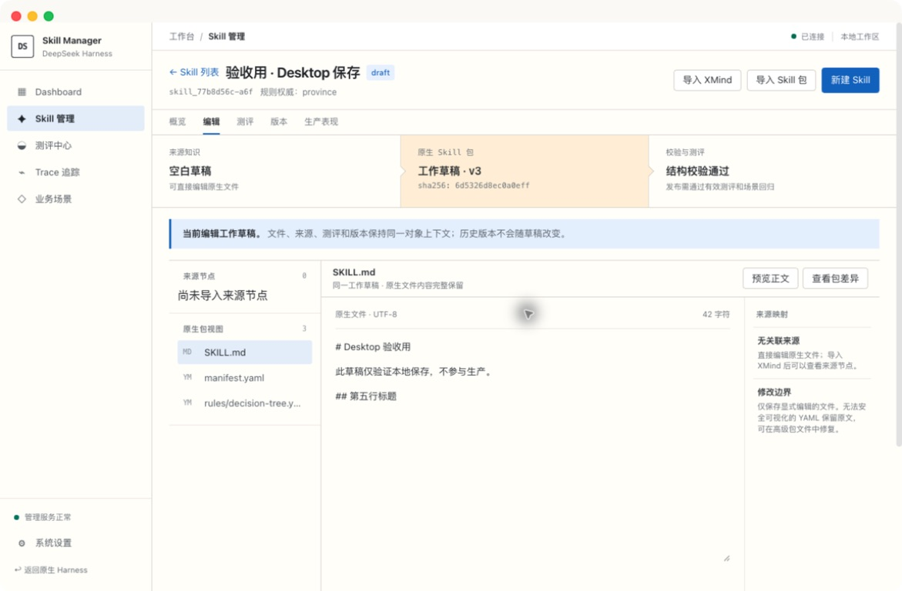
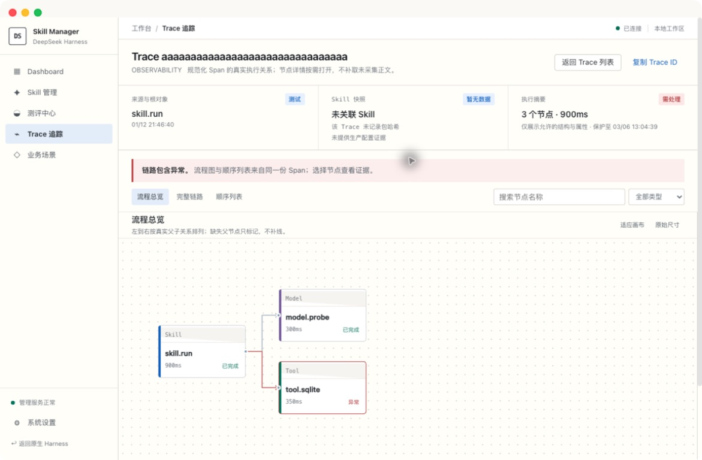
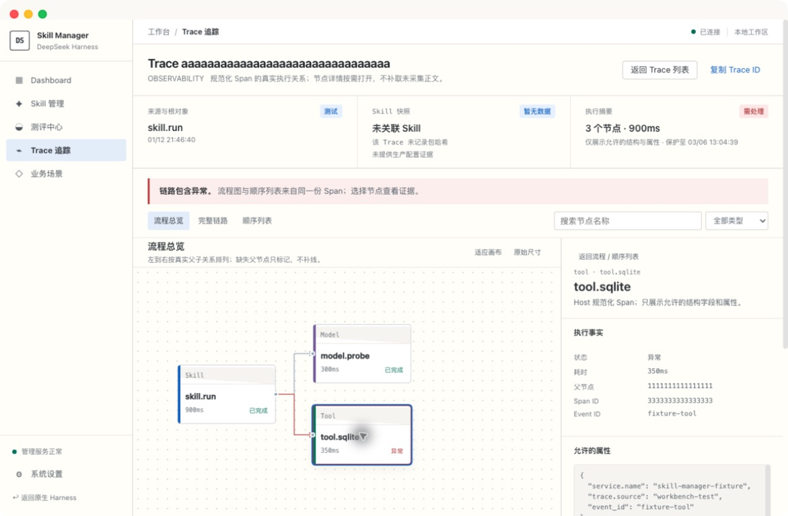
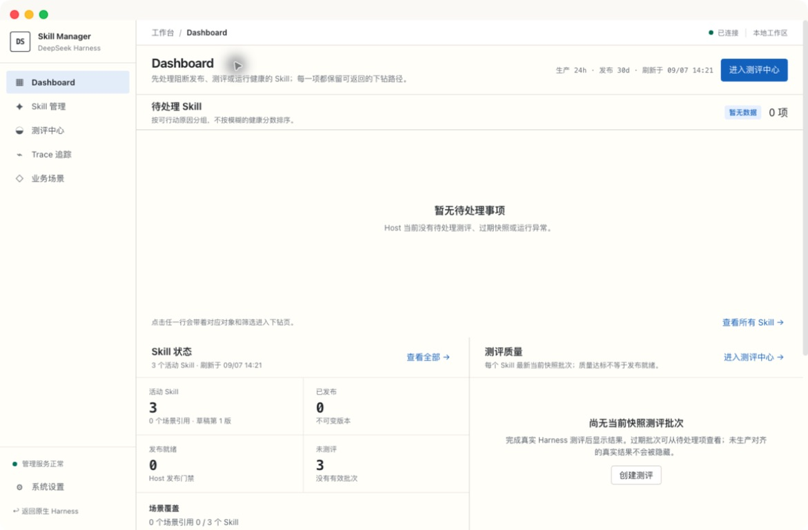

# DSH Skill Manager

在 DeepSeek Harness 中编写、测评、发布和追踪业务 Skill，让每次变更都有可复核的依据。

[快速开始](#快速开始) · [应用预览](#应用预览) · [使用流程](#使用流程) · [模型调用](#模型调用) · [配置与数据](#配置与数据) · [开发](#开发) · [常见问题](#常见问题) · [参与贡献](#参与贡献)

DSH Skill Manager 将 Skill 编辑、业务样例、人工标注、版本发布和执行 Trace 放在同一个工作台。它作为插件运行在已有的 [DeepSeek Harness](https://github.com/deepseek-ai/deepseek-harness) 中，使用 Harness 的模型服务与连接能力，支持 Web 和 Desktop 全页界面，也支持返回原生 Harness。



*Skill 编辑工作台 · 当前 Desktop 界面实拍，展示本地验收草稿。*

> **当前状态：**源码可构建，已完成本机 Web / Desktop 关键业务链路验证；尚未发布 npm 包或预编译安装包。生产系统联调及完整跨平台兼容性仍需按实际环境验证。本项目由社区独立维护，非 DeepSeek 官方出品。

## 核心能力

- **原生 Skill 编辑：**从空白、复制或 XMind 来源开始，在同一草稿中编辑 Markdown、Manifest 和决策树；模型生成的候选变更需逐项审阅后应用。
- **业务样例与测评：**维护业务场景、Excel 解析规则和样例，基于固定 Skill 快照运行模型测评，通过人工标注形成准确率与发布依据。
- **可追溯的版本管理：**校验发布条件，生成不可变版本，保留审计记录；回滚切换运行端生效指针，不覆盖工作草稿。
- **节点式 Trace 检查：**统一查看生产、Harness 原生和工作台测试来源的 Trace，沿节点连接检查父子关系、输入输出、耗时和错误。
- **本地数据与完整工作台：**通过 Dashboard 下钻到待处理对象；使用双 SQLite 持久化业务与运行数据，提供健康检查、成对备份及返回原生界面的入口。

## 快速开始

### 环境要求

- 已安装并能够正常启动的 DeepSeek Harness，提供 `dsh` CLI、Web 服务及插件加载能力。
- Node.js **22.12+**、pnpm 和 Git，用于从源码构建。已验证的开发环境为 Node.js 22.23.2、pnpm 11.22.0。
- 使用模型功能前，在 DSH 中配置并验证至少一个可用的 Provider。
- Desktop 全页 UI 使用允许自定义界面的 Advanced / Creator 环境；这不同于聊天中的 Agent 模式预设。

尚未声明最低兼容 Harness 版本。升级或更换 Harness 构建后，请验证插件加载、保存、模型测评和返回原生界面。

### 安装到 Harness

当前可用路径是**构建源码，再通过官方插件命令安装**。先保存工作并完整退出目标 DSH 实例；在能够运行 `dsh` 的终端执行：

```bash
git clone https://github.com/sherlockmen/dsh-skill-manager-plugin.git
cd dsh-skill-manager-plugin
pnpm install --frozen-lockfile
pnpm run build
dsh plugin --profile web add "$PWD"
```

该命令把插件安装到内置 `web` Profile，并登记插件配置层。目录安装使用本地链接，请保留源码目录，不要在安装后移动或删除它。安装机制见 [Harness 官方插件文档](https://github.com/deepseek-ai/deepseek-harness/blob/master/docs/user/develop/basic/publish.zh.md)。

> 不要直接用本项目包名执行 npm 安装，也不要跳过构建直接安装 GitHub 源码：仓库不包含 `lib/` 产物，目前也没有安装时自动构建的 `prepare` 脚本。

选择一种方式启动：

- **Desktop：**打开 DSH Desktop，选择刚安装的 `web` Profile。
- **浏览器：**执行以下命令，打开终端当次输出的地址。

```bash
dsh --profile web --no-open
```

不要把 `web` 随意改成一个全新 Profile 名：自定义 Profile 可能只有基础层，没有 Web 服务。安装到已有自定义 Profile 时，先确认它包含所需服务。默认不要同时运行 Desktop 和命令行实例，以免 OTLP 端口冲突。

## 应用预览

以下均为当前 DSH Desktop 中的真实界面截图，不是设计稿。截图使用已有验收草稿和工作台测试 Trace；Dashboard 保留当前数据空态，不代表生产运行结果。

### Trace 节点流程

沿 Skill、Model 和 Tool 节点查看父子关系、耗时和异常状态。图中为包含 3 个节点的测试 Trace。



<details>
<summary>展开查看：节点检查器</summary>

选择异常节点后，右侧展示执行状态、父节点、Span ID 和允许查看的属性；仍可对照左侧流程定位节点。



</details>

<details>
<summary>展开查看：Dashboard 工作台</summary>

从待处理事项进入具体业务对象，并查看 Skill 状态和测评质量。当前工作区尚无测评批次，页面如实展示空态。



</details>

## 使用流程

1. **检查连接。**在系统设置确认管理库、运行库和模型通道状态。
2. **编写 Skill。**创建草稿，编辑 `SKILL.md`、Manifest 和决策树；保存后重新打开，确认内容持久化。
3. **准备测评。**在业务场景中关联 Skill、添加业务样例；使用 Excel 时先确认解析规则和回归结果。
4. **运行并标注。**创建固定快照的测评批次，核对 Provider / Model，查看模型实际输出和 Trace，再逐条人工标注。自动比对不会代替人工结论。
5. **审查并发布。**检查当前草稿、有效测评和生产执行配置是否满足发布条件；发布后查看版本与审计记录。

修改草稿会使旧快照测评过期，需要重新测评。模型调用成功不等于发布条件全部满足；管理端发布成功，也不等于生产应用已经加载该版本。

退出工作台：进入 **系统设置 → 返回原生 Harness**。该操作恢复原生界面，不关闭 DSH；重新加载页面可再次进入插件。

## 模型调用

插件复用 DSH 的 Provider 地址和凭据，不在浏览器中直连模型，也不另建一套模型客户端。

```text
React 工作台（Web / Desktop）
  → Harness Remote / Typert RPC
  → 插件 Host 业务服务与后台任务
  → ctx.llm.stream()
  → DSH Provider → 模型服务
  → 插件处理结果、保存测评与 Trace → 工作台展示
```

Provider 和 Model 分别按以下优先级解析：

1. 测评批次冻结的 `executionProfile`。
2. 插件配置的 `provider` / `model`。
3. 插件 `productionProfile` 中的 Provider / Model。
4. DSH 注册列表中的首个 Provider，以及该 Provider 的首个模型。

候选生成从第 2 项开始选择。**DSH 列表首项不是原生聊天当前选择的模型**；切换聊天模型不会修改已创建批次的执行配置。

当前调用的是 **Harness 模型接口，而非完整 Agent 工具循环**。测评将 Skill 文件快照和业务输入组织成提示词，由模型返回结果，再由插件处理和保存；不会创建原生聊天会话来执行多轮工具调用。实现见 [`src/host/service.ts`](src/host/service.ts)。

## 配置与数据

插件条目 ID 为 `skill-manager`。在目标 Profile 的 `cordis.patch.yml` 中配置其 `config`，或通过启动 DSH 的进程环境传入以下变量；显式插件配置优先于对应环境变量。

| 配置项 | 环境变量 | 默认与用途 |
| --- | --- | --- |
| `dataDir` | `DSH_SKILL_MANAGER_DATA_DIR` | 启动工作目录下的 `.dsh-skill-manager`；建议固定为绝对路径 |
| `provider` | `DSH_SKILL_MANAGER_PROVIDER` | 未指定；引用 DSH 已注册的 Provider ID |
| `model` | `DSH_SKILL_MANAGER_MODEL` | 未指定；引用对应 Provider 的模型 ID |
| `productionProfile` | `DSH_SKILL_MANAGER_PRODUCTION_PROFILE` | 未指定；声明生产执行目标，环境变量使用 JSON 对象 |
| `otlpPort` | `DSH_SKILL_MANAGER_OTLP_PORT` | `4319`；设为 `false` 关闭接收器 |

修改配置时保留已有条目，不要覆盖整个 Profile 文件；修改后完整重启 DSH。从桌面图标启动的应用不一定继承终端环境变量。

### 数据存放

- `manager.sqlite`：工作草稿、业务场景、测评、任务与管理审计。
- `runtime.sqlite`：发布版本、生效指针与 Trace。

在系统设置查看实际目录并创建双库备份。改变 `dataDir` 不会自动迁移已有数据；两端出现不同列表时，先核对目录，不要删库。旧版数据库升级前会创建 `schema-backups` 快照。

OTLP 接收器仅监听本机 `127.0.0.1`，入口为 `POST /v1/traces`。生产 Trace 需要业务应用实际接入；未接入时不生成模拟生产指标。

## 开发

在已安装依赖的仓库根目录运行：

```bash
pnpm run typecheck
pnpm test
pnpm run build
```

构建同时生成 Host ESM 和 Browser ModuleLoader 产物，并验证最终 Browser 产物中的多行正文与 Markdown。源码测试覆盖草稿、测评、发布、迁移和界面交互；截至 2026-09-07，本机通过 20 个测试文件、117 项测试，不代表全部环境的兼容性保证。

其中 3 项 Gateway 集成测试需要已构建的 Harness 源码。运行前将 `DSH_HARNESS_ROOT` 设置为该 checkout 的绝对路径；未找到 Harness 时，这 3 项会跳过。纯源码环境的测试通过不等于完整宿主集成验证。

仅调整界面时，可以启动预览：

```bash
pnpm run dev
```

**Vite 预览使用内存数据，不连接真实 DSH、SQLite 或模型。**真实业务验收必须在 Harness 中完成。源码修改后重新构建并完整重启 DSH；只刷新页面可能仍使用旧 Host。

### 代码结构

```text
src/
├── client/       React 工作台、Remote 客户端与独立预览适配器
├── contracts/    Host / Browser 共享契约与方法描述
├── domain/       Skill 校验、准确率和原生包规则
├── host/         业务服务、SQLite、模型调用、Excel 与 OTLP
└── index.ts      Harness Host 插件入口
test/            领域、服务、协议与界面回归测试
scripts/         构建及产物验证
migrations/      管理库与运行库参考 SQL
schemas/         版本化协议 Schema
```

Harness 根据 [`package.json`](package.json) 的声明加载插件，包标识为 `@deepseek-ai/dsh-skill-manager-plugin`。集成入口包括主入口、`/client`、`/contracts`、`/remote`、`/cordis.patch.yml` 和 `/package.json`；它们服务于 Harness 加载与协议集成，不是独立的模型 SDK。前端采用 React + TypeScript，Vite 构建；后端通过 esbuild 构建，数据使用 Node.js SQLite。

## 常见问题

**终端找不到 `dsh`？**

从 Desktop 打开 DSH 终端，确认 CLI 可用。如果通过 Harness 源码运行，在已准备好的 Harness checkout 中使用 `pnpm run dsh`；参见[官方插件文档中的源码 CLI 说明](https://github.com/deepseek-ai/deepseek-harness/blob/master/docs/user/develop/basic/publish.zh.md)。

**页面能打开，却提示无法连接？**

先确认打开的是 DSH 输出的地址，而非 Vite 预览。检查当前 Profile、Host 插件加载错误，并完整重启；不要禁用 Desktop 或基础服务来解决界面冲突。

**模型通道正常，测评却失败？**

通道正常只说明服务已注册。查看具体任务错误，核对批次使用的 Provider / Model，再检查模型服务的网络、鉴权和推理状态。

**它会直接执行生产业务吗？**

不会。插件负责管理、测评和发布；生产业务由独立运行端执行。运行端没有回报加载状态时，工作台显示未知，不把管理端发布当作生产已生效。

## 当前边界

- XMind 支持树节点语义；非树关系等内容会标记为不支持，不承诺完整无损往返。
- 尚未提供 npm 发行、预编译 Release 或插件市场一键安装。
- Docker / Compose、本地模型部署、生产网络与 LangChain / Redis 端到端联调不包含在当前交付中。
- 当前面向本机或受控内网；不提供独立的多用户权限隔离，不应无保护地暴露到公网。业务输入会发送到所选 Provider，使用前确认其数据处理政策。

## 参与贡献

欢迎通过 [Issues](https://github.com/sherlockmen/dsh-skill-manager-plugin/issues) 提交问题和改进建议。报告问题时请提供 Harness 版本或构建信息、插件提交号、Web / Desktop 环境、复现步骤及脱敏错误信息，不要上传模型密钥、访问 token、业务数据库或原始生产样本。

提交代码前运行类型检查、测试和构建；修改 Host / Browser 契约时同步检查两端描述，修改界面时在真实 Harness 中验证。贡献应保留候选人工确认、快照测评和发布审计等业务边界。

## 许可证

[MIT](LICENSE) © 2026 sherlockmen。第三方组件遵循各自的许可证；本许可证不替代 DeepSeek Harness 及其依赖的授权条款。
